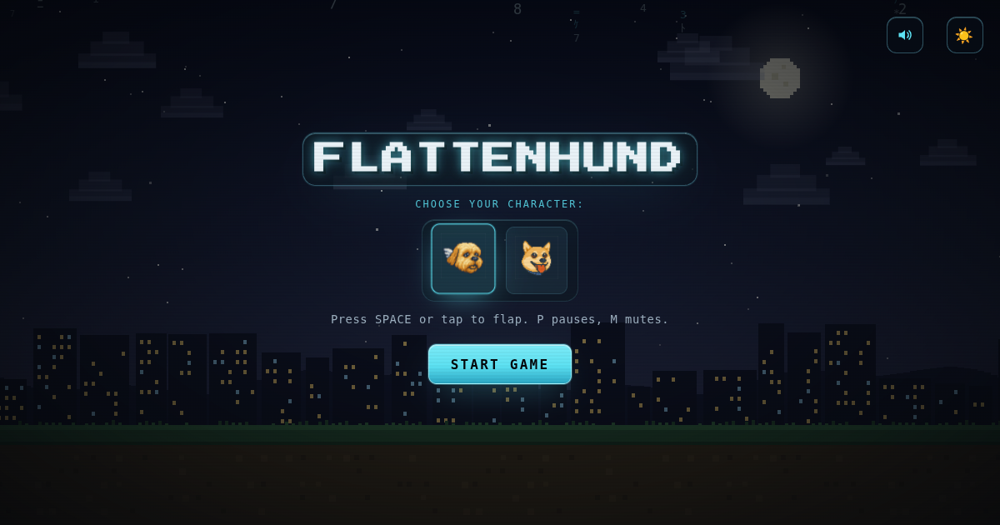

# Flattenhund

A retro pixel-art flappy game with a matrix-blue glass interface, synthesized chiptune sound and a leaderboard that keeps working when the server does not. Built by Michael Preciado / Preciado Tech.



## Features

- Pixel-art world (parallax hills or a lit skyline, drifting clouds, birds by day, shooting stars and a UFO by night) under a glass UI: near-black `#04060a`, one cyan `#5ce1f2`
- Fixed 120 Hz physics with render interpolation, so 60, 120 and 144 Hz displays play the same
- Game feel: perfect-pass combo chips, milestone bursts, screen shake and flash, a tumbling death, particle trail and glow
- WebAudio sound effects (no audio files), mute button or `M`, remembered between visits
- Touch first: one tap flaps, 44 px targets, safe-area aware, pauses when the tab loses focus
- Accessible: keyboard playable, focus rings, labelled controls, `prefers-reduced-motion`, forced-colors
- Installable PWA with an offline shell and versioned caches
- Leaderboard: shared SQLite board when the server is up, a local board on the device when it is not (scores sync later)
- Zero npm dependencies

## Run it

```bash
npm start          # http://localhost:8000
```

Any Node 18+ works. On Node 22.5+ the leaderboard uses the built-in SQLite; on older Node it falls back to a JSON file store automatically. Set `PORT`, `HOST` or `DATA_DIR` to change where it listens or stores data. To only serve the game files: `npm run start:static`.

Check the code: `npm run check` (syntax check of the server and every script).

### Controls

| Action | Keyboard | Touch / mouse |
| --- | --- | --- |
| Flap / start | Space, Up, W | Tap or click the field |
| Pause / resume | P or Esc | Tap the pause card |
| Mute | M | Speaker button |
| Day / night | Moon button | Moon button |

## How it plays

Pipes come every 2 s at a fixed speed and the gap tightens from generous to 170 px over the first 10 points. The hitbox is 5 px smaller than the sprite on each side, and successive gaps are never more than 260 px apart, so every pipe is reachable. Passing within 30 px of a gap centre is a "perfect": it builds a combo with extra juice and higher pitched chimes, but never changes the score.

## Project structure

```text
index.html               entry point, meta / Open Graph tags, markup
style.css                base pixel styling
css/preciado-glass.css   glass design system, HUD, overlays, a11y (loaded last)
css/dark-mode.css        night-mode variables
js/game.js               fixed-step loop, physics, input, game flow
js/drawing-functions.js  cached parallax scenery, ground, pipes
js/background-effects.js pooled birds, shooting stars, UFO
js/audio.js              WebAudio engine and mute
js/fx.js                 glyph rain, flash, shake
js/mobile-optimization.js viewport, haptics, wake lock, toast
js/local-db.js           leaderboard client with local fallback
js/leaderboard.js        board UI, nickname flow, name filter
server/                  Node server, storage layer, SQL schema
sw.js, manifest.json     PWA
```

## Leaderboard

See [LOCAL_DATABASE.md](LOCAL_DATABASE.md) for the API and storage details. On a static host (Vercel, Netlify, GitHub Pages) the API is absent, the client notices within 2.5 s and the game uses the local board. Scores earned meanwhile are queued and posted the next time the API answers.

## Deployment

The game is static and deploys as-is (`vercel.json`, `netlify.toml`). For a shared leaderboard run `npm start` on any host that can run Node.

Release checklist:

1. Bump `CACHE_VERSION` in `sw.js` when the precache list or any art/font changes (code is network-first, so JS/CSS/HTML updates never need a bump).
2. Make `og:image` and `twitter:image` in `index.html` absolute URLs on your domain; most crawlers ignore relative ones.

## License

MIT
